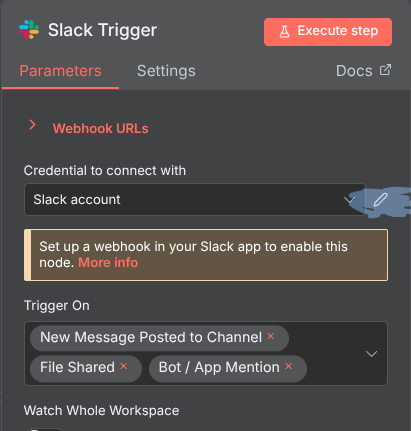
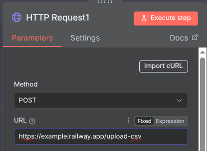

# Interactive Data Insights Bot 
## Using Data Science and MCP

**Objective:** To build an AI-powered assistant that analyses uploaded datasets and returns insights via collaboration platforms, such as summaries, trends, or charts.

**Skills:** Python (Pandas, Matplotlib, Seaborn), Basic Statistics and EDA, API integration.

**Expected learning:** Applied data science concepts, End-to-end AI pipeline integration with MCP tools

**Specific course topics required for project execution:** Python fundamentals (Pandas, Numpy), Exploratory Data Analysis (EDA), Data visualization libraries (Matplotlib, Seaborn), Intro to Slack/Teams API messaging.

## Pre-requisites
1. Have a huggingface account with a write token and access to llama3-8b-Instruct.

2. Have a slack API access token.

3. Import workflow.json into n8n. And setup the Slack trigger with your own channels and account. (You can edit this to work with MS teams and stuff too).



4. Set your OpenAI credentials in the AI Agent node as well. Again you're free to use a different model.

## Setup

1. Host the repo on Railway or a similar service.

2. Add 2 variables to the service (I'll be using Railway as the example): 
```
    HF_TOKEN=<Your HuggingFace Token>
    PUBLIC_HOST_URL=https://example.up.railway.app
```
3. Host your repo with :

    - Build command : `pip install -r requirements.txt`
    - Deploy command: `uvicorn main:app --host 0.0.0.0 --port $PORT`

4. Edit HTTPrequest1 url to send a POST request to your API with /upload-csv endpoint. Eg. `https://example.up.railway.app/upload-csv`




5. Activate the n8n workflow.


--- 

## Issues (and how to resolve them)

- If your hosting service shows 502. Go to the logs and check if the port shown in `Uvicorn running on http://0.0.0.0:8000 (Press CTRL+C to quit)` matches the one in networking tab.

- Sometimes there's issues with llama's context window being too small for large numerical databases. But you're free to change the model in `llama3.py` under `gen_insights()`.

- Any issues with n8n workflow, please check where your requests are being sent and recieved. Along with your Access tokens for Slack and OpenAI.